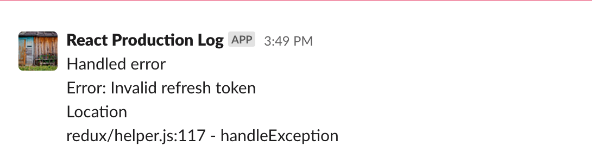

# react-slack-notification

#### React Slack Notification is a lightweight package, Send messages to a Slack channel directly from your react app.

[](http://nodejs.org/download/)
[](https://www.npmjs.com/package/react-slack-notification) [](https://standardjs.com)

## Install

```bash
npm install --save react-slack-notification
```
OR

```bash
yarn add react-slack-notification
```

## Usage
#### Send your error logs directly to the slack channel without third party integration.

```jsx
import notifyToSlackChannel from 'react-slack-notification';

class ErrorBoundary extends React.Component {
  constructor(props) {
    super(props);
    this.state = { hasError: false };
  }

  static getDerivedStateFromError(error) {
    // Update state so the next render will show the fallback UI.
    return { hasError: true };
  }

  componentDidCatch(error, errorInfo) {
    // Log the error to a slack channel
    notifyToSlackChannel('https://hooks.slack.com/services/xxxxxxxxxxxxx/example/webhook', error);
  }

  render() {
    if (this.state.hasError) {
      // You can render any custom fallback UI
      return <h1>Something went wrong.</h1>;
    }

    return this.props.children;
  }
}
```

### Override Channel, Username, Bot Icon

```jsx
notifyToSlackChannel(webhook,message,#channel/@username,username,botIconURL);
```

`webhook`: Generate using [incoming Webhook](https://slack.com/apps/A0F7XDUAZ-incoming-webhooks)

`message`: Text to notify

`#channel/@username`: Override the channel in Webhook or Direct message to a user in your workspace

`username`: Message will be displayed using this name

`botIconURL`: Message bot icon

### Sample Message



## License

The MIT License (MIT). Please see [License File](LICENSE) for more information.
